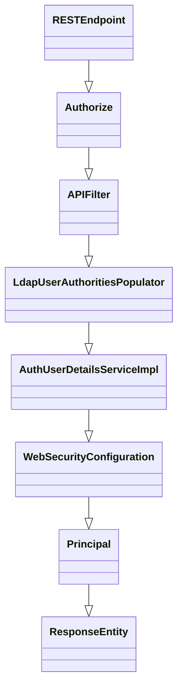
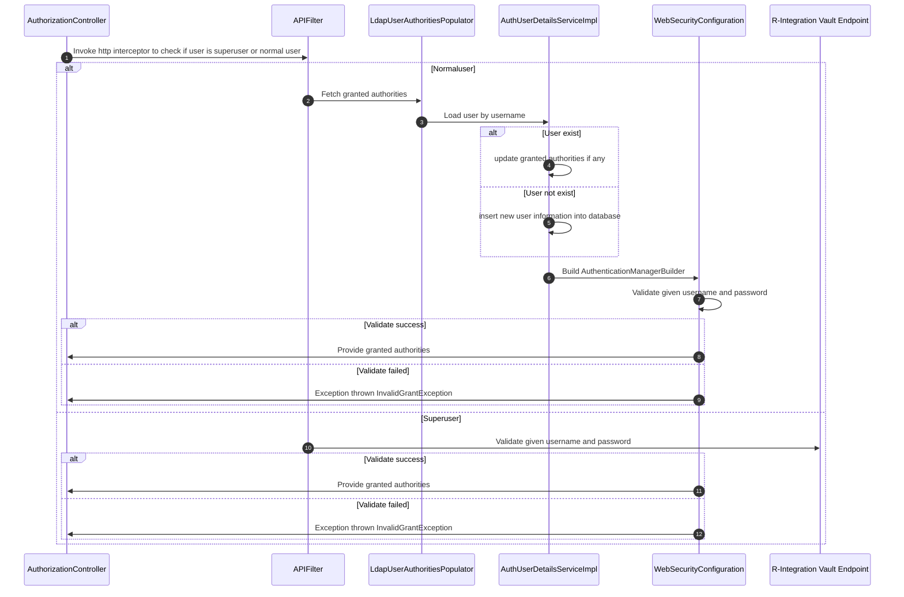

# R-Auth High Level overview
## Overview
R-Auth is an Authentication system for integrating with all systems.
```go
R-Auth is a containerized application
R-Auth runs on port: `8092`
R-Auth is orchestrated by kubernetes
R-Auth deployment life cycle is managed by helm
R-Auth is responsible for integrating with all external systems in "Solution R"
R-Auth REST endpoints(Rel 1.0) starts with base context 'v1/rauth/'
```
## Capability
```go
 - Accesses authentication server via Ldap
 - Integrates with external Solution R microservices. Supported microservices are,
   - R-Data
 - Provides endpoints for CRUD operations on certain tables in R-Auth database, 
   - Roles
   - Authorities
```
## Architecture Flow Diagram

---
# R-Auth Documents
## Features
### Overview
R-Auth provides below importatnt features:
1. Authorization service
### Authorize flow

