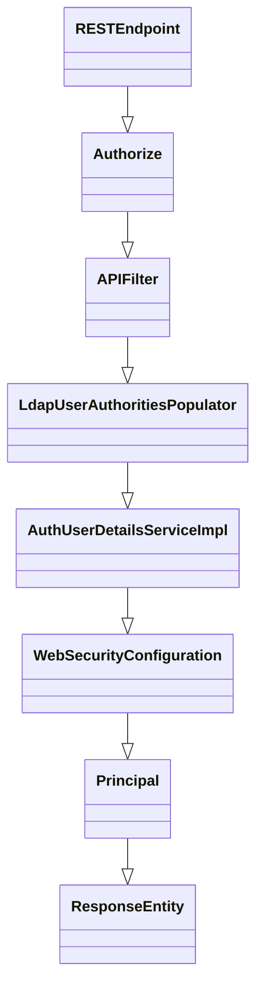
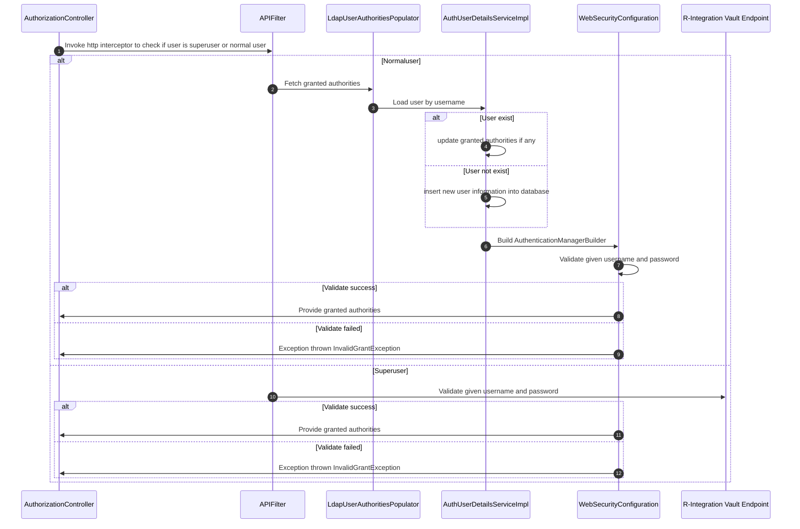

# R-Auth High Level overview
## Overview
R-Auth is an Authentication system for integrating with all systems.
```go
R-Auth is a containerized application
R-Auth runs on port: `8092`
R-Auth is orchestrated by kubernetes
R-Auth deployment life cycle is managed by helm
R-Auth is responsible for integrating with all external systems in "Solution R"
R-Auth REST endpoints(Rel 1.0) starts with base context 'v1/rauth/'
```
## Capability
```go
 - Accesses authentication server via Ldap
 - Integrates with external Solution R microservices. Supported microservices are,
   - R-Data
 - Provides endpoints for CRUD operations on certain tables in R-Auth database, 
   - Roles
   - Authorities
```
## Architecture Flow Diagram

---
# R-Auth Documents
## Features
### Overview
R-Auth provides below importatnt features:
1. Authorization service
### Authorize flow


## Database
### Roles
```go
Roles:
  Represents all the available roles for users. It will be matched from the Ldap groups and generated at the beginning of the API start-up using query script. 
  
Database table name: roles

Database Table Structure:

                                                     Table "rauth.roles"
   Column   |            Type             | Collation | Nullable | Default | Storage  | Stats target | Description 
------------+-----------------------------+-----------+----------+---------+----------+--------------+-------------
 id         | uuid                        |           | not null |         | plain    |              | 
 created_at | timestamp without time zone |           | not null |         | plain    |              | 
 updated_by | character varying           |           |          |         | extended |              | 
 updated_at | timestamp without time zone |           |          |         | plain    |              | 
 version    | integer                     |           | not null |         | plain    |              | 
 role       | character varying(256)      |           | not null |         | extended |              | 
Indexes:
    "roles_pk" PRIMARY KEY, lsm (id HASH)
    "roles_uindex" UNIQUE, lsm (lower(role::text) HASH)
Referenced by:
    TABLE "roles_authorities" CONSTRAINT "roles_authorities_roles_id_fk" FOREIGN KEY (role_id) REFERENCES roles(id)
    
Unique column: role (Roles with same role will be considered duplicate and cannot be allowed; case sensitive)

Sample record:
 9a7e5c14-4b96-11ed-bdc3-0242ac120002 | 2022-09-21 10:34:57.497467 |            |            |       1 | ROLE_DEVELOPERS

REST supported operations:

post          - Creates new role record, URI: <base context>/roles
list all      - Retrieves all roles, URI: <base-context>/roles/
list          - List specific role, URI: <base-context>/roles/{id}
update        - Updates specific role record, URI: <base-context>/roles/{id}
update status - Updates specific role record status, URI: <base-context>/roles/{id}
```

### Authorities
```go
Roles:
  Represents all the available authorities for users. It will be generated at the beginning of the API start-up using query script. One super user will be granted with the SUPER_ROLE authority which enables all endpoints.
  
Database table name: authorities

Database Table Structure:
                                             Table "rauth.authorities"
   Column   |            Type             | Collation | Nullable | Default | Storage  | Stats target | Description 
------------+-----------------------------+-----------+----------+---------+----------+--------------+-------------
 id         | uuid                        |           | not null |         | plain    |              | 
 created_at | timestamp without time zone |           | not null |         | plain    |              | 
 updated_by | character varying           |           |          |         | extended |              | 
 updated_at | timestamp without time zone |           |          |         | plain    |              | 
 version    | integer                     |           | not null |         | plain    |              | 
 authority  | character varying(256)      |           | not null |         | extended |              | 
Indexes:
    "authorities_pk" PRIMARY KEY, lsm (id HASH)
    "authorities_uindex" UNIQUE, lsm (lower(authority::text) HASH)
Referenced by:
    TABLE "roles_authorities" CONSTRAINT "roles_authorities_authorities_id_fk" FOREIGN KEY (authority_id) REFERENCES authorities(id)
    TABLE "users_authorities" CONSTRAINT "users_authorities_authorities_id_fk" FOREIGN KEY (authority_id) REFERENCES authorities(id)
    
Unique column: authority (Authorities with same authority will be considered duplicate and cannot be allowed; case sensitive)

Sample record:
87ad3c48-4db9-11ed-bdc3-0242ac120002 | 2022-09-21 10:34:57.497467 |            |            |       1 | UPDATE_CODEC

REST supported operations:

post          - Creates new authority record, URI: <base context>/authorities
list all      - Retrieves all authorities, URI: <base-context>/authorities/
list          - List specific authority, URI: <base-context>/authorities/{id}
update        - Updates specific authority record, URI: <base-context>/authorities/{id}
update status - Updates specific authority record status, URI: <base-context>/authorities/{id}
```

