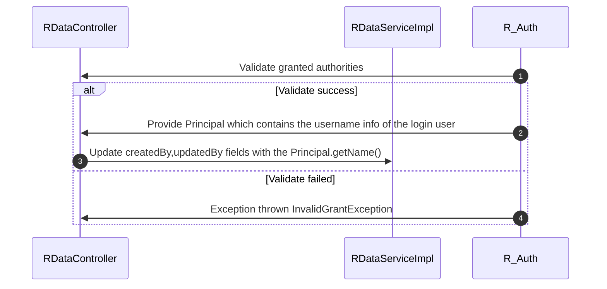

# R-Data High Level overview
## Architecture Flow Diagram
### Update createdBy,updatedBy fields Flow

```mermaid
  sequenceDiagram
  autonumber
  participant RDataController
  participant RDataServiceImpl
  participant R_Auth
  R_Auth->>RDataController: Validate granted authorities
  alt Validate success
      R_Auth->>RDataController: Provide Principal which contains the username info of the login user
      RDataController->>RDataServiceImpl: Update createdBy,updatedBy fields with the Principal.getName() 
  else Validate failed
      R_Auth->>RDataController: Exception thrown InvalidGrantException
      end
```
